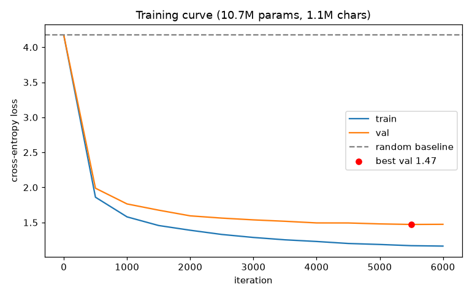
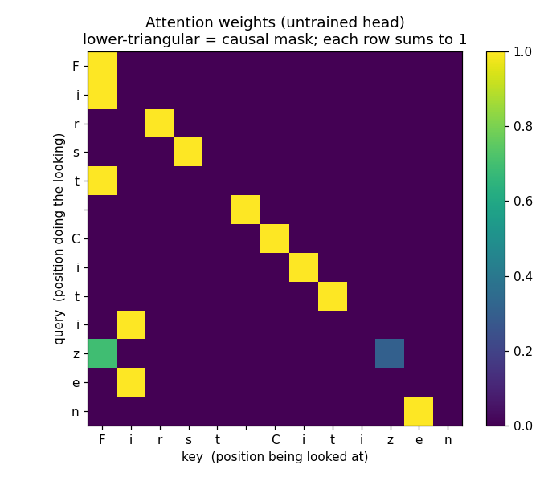
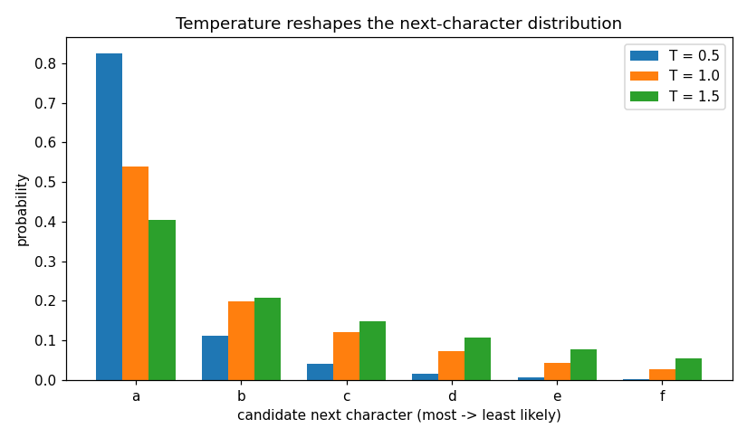
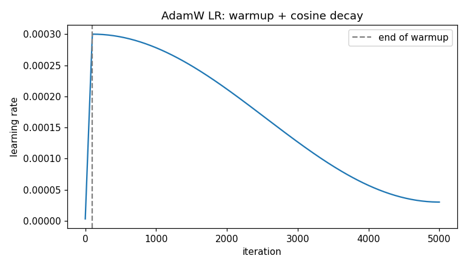

# shakespeare-gpt

A GPT-style language model built **from scratch in raw PyTorch** — no HuggingFace,
no transformer libraries — and trained on Shakespeare. Every component (tokenizer,
embeddings, multi-head self-attention, transformer blocks, training loop, sampler)
is implemented from first principles.

Two model sizes are supported: a ~0.8M-parameter baseline for fast experiments and
a ~10.7M-parameter model trained on the full corpus for stronger samples.

## Architecture

```
ids ─▶ token + position embedding ─▶ N× Transformer Block ─▶ LayerNorm ─▶ Linear head ─▶ logits
                                        │
                                        ├── multi-head causal self-attention   (tokens communicate)
                                        └── feed-forward network               (per-token compute)
                                        each wrapped in a pre-norm residual
```

**Training/quality features:** AdamW, learning-rate **warmup + cosine decay**,
**weight tying** (shared input/output embeddings), dropout, gradient clipping, a
train/validation split, and **early stopping** (the best-validation checkpoint is
saved). **Sampling:** temperature, top-k, top-p (nucleus), and greedy decoding.

## Layout

```
shakespeare-gpt/
├── gpt/
│   ├── config.py        # GPTConfig: all hyperparameters
│   ├── tokenizer.py     # character-level tokenizer (text <-> ids)
│   ├── embeddings.py    # token + positional embeddings
│   ├── attention.py     # Head + MultiHeadAttention (Q/K/V, scaling, causal mask)
│   ├── block.py         # FeedForward + Block (residuals + layer norm)
│   ├── model.py         # GPTLanguageModel (assembles the full network)
│   ├── train.py         # baseline cross-entropy + AdamW training loop
│   └── sample.py        # autoregressive generation (temperature, top-k, top-p, greedy)
├── experiment.py        # scaled-up training run + metrics reporting (recommended)
├── generate.py          # CLI: sample from a trained checkpoint
├── input.txt            # training corpus (download the full version — see below)
├── assets/              # figures explaining each component
├── requirements.txt
└── README.md
```

## Setup

```bash
python3 -m venv .venv && source .venv/bin/activate   # Python 3.11 or 3.12
pip install -r requirements.txt
```

## Get the full corpus (recommended)

The bundled `input.txt` is a ~98K-character slice. For the stronger model, fetch
the full ~1.1M-character corpus:

```bash
curl -o input.txt https://raw.githubusercontent.com/karpathy/char-rnn/master/data/tinyshakespeare/input.txt
```

## Train

```bash
python experiment.py            # ~10.7M-param model, full features, prints metrics + saves best checkpoint
python experiment.py --small    # ~0.8M-param baseline, for comparison
python -m gpt.train             # the original minimal baseline loop
```

Auto-selects CUDA / Apple-Silicon `mps` / CPU. Initial loss should be ≈ `ln(61) ≈ 4.11`
(a uniform guess over the 61-character vocabulary) — a quick sanity check.

## Generate

```bash
python generate.py --prompt "ROMEO:" --tokens 400 --temperature 0.8 --top_k 20
python generate.py --top_p 0.9
```

`generate.py` reads the architecture from the checkpoint, so it works with either
model size automatically.

## Results

Character-level cross-entropy (lower is better); perplexity = e^loss; the random
baseline is `ln(61) = 4.11` (perplexity 61).

| Model | Params | Corpus | Best val loss | Perplexity | vs. random |
|---|---|---|---|---|---|
| Baseline | 0.8M | 98K chars | 1.59 | 4.9 | −61% |
| Scaled (full corpus) | 11M | 1.1M chars | **1.47** | **4.4** | **−65%** |

On the 98K slice the baseline **overfits**: validation loss bottoms at 1.59 then climbs
to 2.21 as the model memorizes. Trained on the full 1.1M-character corpus, the
**11M-parameter** model reaches **validation perplexity 4.36 (loss 1.47)** — beating the
baseline's best — with only a mild train/validation gap (~0.30), held in check by dropout
and early stopping (the best checkpoint, iter 5500, is saved automatically; validation
ticked up afterward). Scaling the data ~11× is what turns memorization into generalization.



## Notes

- The trained checkpoint (`shakespeare_gpt.pt`) is gitignored as a regenerable
  build artifact; recreate it with `python experiment.py`.
- Inspired by Andrej Karpathy's nanoGPT / "Let's build GPT", reimplemented from
  scratch as a learning project.

## Figures

| Self-attention weights (causal) | Temperature reshapes sampling | LR schedule |
|---|---|---|
|  |  |  |
